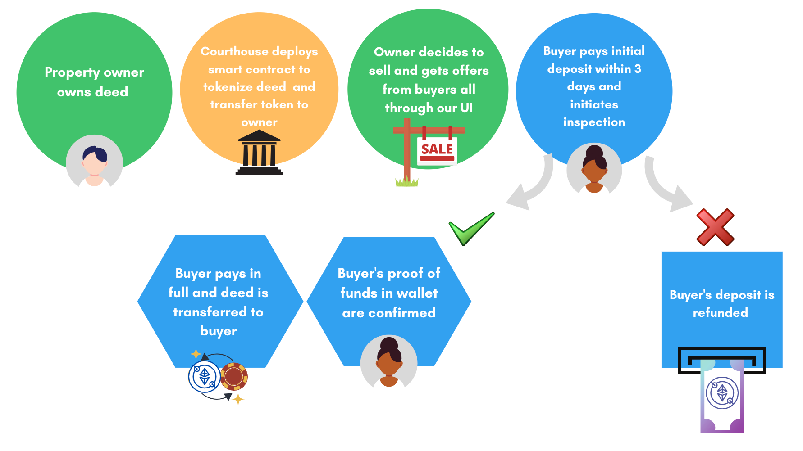

# **Real Estate Revolution**
---
### Contributors:
### Farah Awad, Akrem Mohamed, Jeff Myers, Cathy Slider
---

# The above flowchart showcases the goal of the smart contract. Details are below:

1) Similar to today's world (2021), every property owner holds a deed. In the future, property owners will hold a non-fungible tokenized deed that is deployed via a smart contract through the courthouse. 

2) When the owner of the property (the holder of the token) elects to put their property on the market they will use our user interface to initiate the 60 day contract.

3) The potential buyer of the token (the seller's deed) will have 3 days to put down a deposit and initate the normal inspection process of the property, separately from this contract. If the the inspection fails, ***the buyer will be refunded his deposit in full.***

4) If the inspection is successful, the contract will move forward. 

5) Next, the buyer's proof of funds will be shown in his wallet to confirm the purchase. 

6) Finally, after the 60 day window the funds are transferred to the seller and the token (deed) is sent to the buyer.